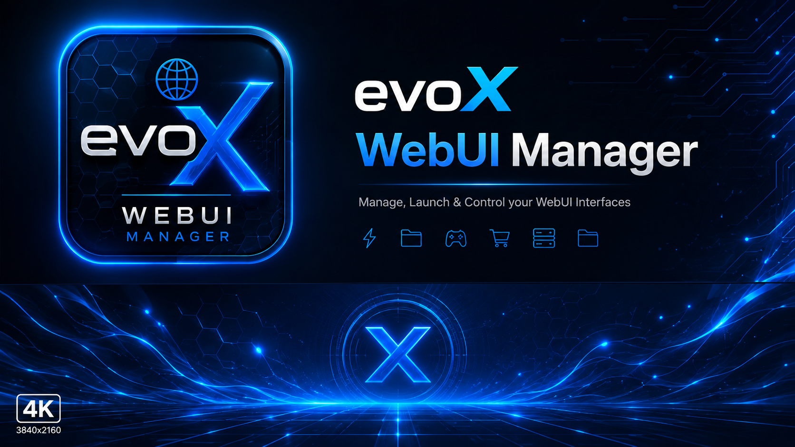

# evoX WebUI Manager

**evoX WebUI Manager** est une page web de redirection simple et moderne conçue pour centraliser et lancer rapidement toutes vos interfaces WebUI locales et payloads ELF pour PS5. Pensée pour être exécutée de manière optimale via le **browser eboot fullscreen de Michele Media**, elle offre une navigation fluide et élégante directement taillée pour l'écosystème PS5.

## 🌟 Fonctionnalités

* **Dashboard centralisé** : Visualisez et accédez d'un seul clic à l'ensemble de vos outils et interfaces.
* **Gestion par catégories** : Navigation intuitive classée par thématiques pour retrouver immédiatement votre utilitaire.
* **Design Sci-Fi / Dark Mode** : Interface épurée aux tons bleus néon et métalliques, parfaitement adaptée aux écrans de télévision et moniteurs.
* **Indicateurs de ports dynamiques** : Statut en temps réel des liens et des ports locaux associés.

---

## 📋 Liste des WebUI Supportées

### ⚡ HEN
* **PLDMGR** (Payload Manager) - Port : `8084`
* **EvoX** (Interface principale) - Port : `8085`
* **Prospero Manager** (Gestion système Prospero) - Port : `7070`
* **Pizza-Hen Toolbox** - Port : `8080`
* **Elf-Arsenal** (Boîte à outils ELF) - Port : `6969`
* **Voidshell** (Shell système) - Port : `7007`
* **Kura** - Port : `8535`

### 🎮 Game Management
* **Game Compressor** (Compression et gestion des ROMs/jeux) - Port : `5910`
* **ShadowMountPlus** (Montage avancé de jeux) - Port : `10101`

### 💾 Saves Management
* **Garlic SaveMgr** (Gestion des sauvegardes) - Port : `8082`
* **Garlic Saves** (Site web officiel) - [garlicsaves.com](https://garlicsaves.com)

### 🎯 Cheat
* **CheatRunner** (Moteur de triche et édition mémoire) - Port : `9999`
* **Kyline Core** (Moteur de triche et édition mémoire) - Port : `9023`

### 🛒 Free Shop
* **Pegasus-Dl** (Téléchargeur Pegasus) - Port : `6970`
* **Spectrum Library** - Port : `7575`

### 🛠️ Server
* **Zhttp** (Serveur HTTP léger) - Port : `8888`
* **PS5 LocalSend** (Récepteur de fichiers réseau local) - Port : `53317`
* **websrv** (Serveur web local) - Port : `8080`

### 📁 File Manager
* **BFpilot** (Navigateur et gestionnaire de fichiers) - Port : `5905`
* **PS5 Web File Manager** - Port : `8888`
* **PS5 File Explorer** - Port : `5905`

---

## 👥 Crédits

* **[nexgen999](https://x.com/nexgen999)** : Développeur principal & Concepteur de l'écosystème.
* **[Michele Media](https://x.com/MikeleMedia)** : Développeur, support technique & Concepteur de l'eboot.
